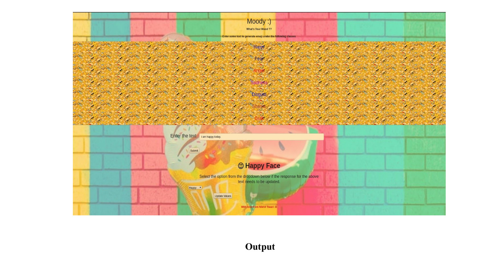

## What's Your Mood ? :)
A natural language processing(NLP) based flask app deployed on heroku which predicts the Emotion by generating emojis based on the sentence provided by the User.

#### Input Text- I am happy today.

#### Output - Happy Emoji

